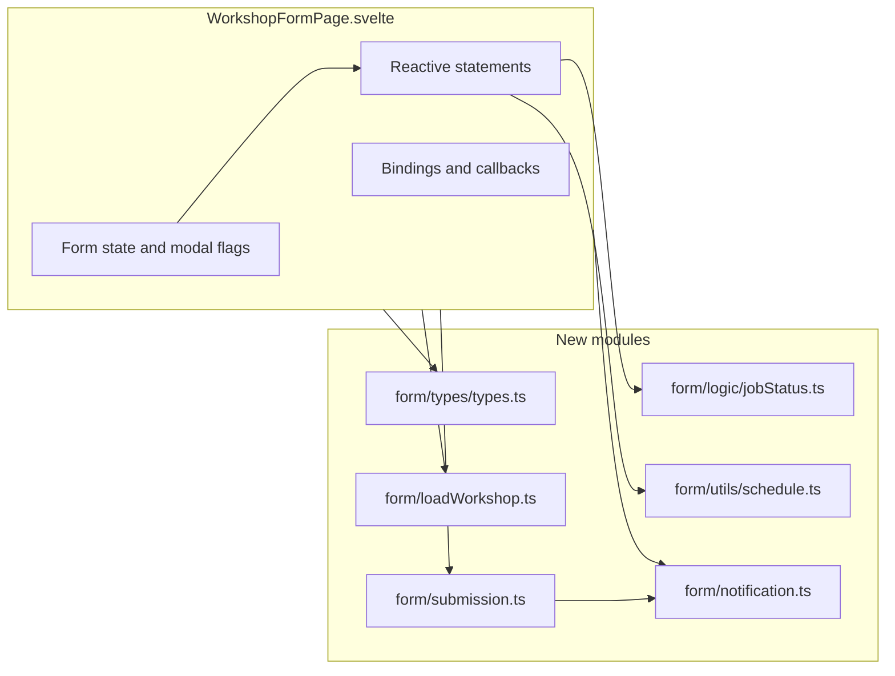

# Workshop Form Page Refactor Plan

## Goal

Reduce [WorkshopFormPage.svelte](src/routes/(protected)/workshop/form/WorkshopFormPage.svelte) from ~2,840 lines to a thin orchestrator by moving types and logic into dedicated modules. No change to UI or user-visible behavior; existing components (WorkshopHeader, MachineInformationSection, etc.) and [WorkshopModals.svelte](src/routes/(protected)/workshop/form/components/WorkshopModals.svelte) stay as-is.

## Current Structure

- **Script (~2,575 lines):** 100+ `let` variables, ~50 functions, reactive statements, and inline types.
- **Markup (~265 lines):** Form layout that composes 8 existing section/modal components.
- **Entry:** [form/+page.svelte](src/routes/(protected)/workshop/form/+page.svelte) only mounts `WorkshopFormPage`; no changes needed there.

## Target Architecture

---

## Phase 1: Types and job status (low risk)

**1.1 Add form-specific types**

- **New file:** `src/routes/(protected)/workshop/form/types/types.ts`
- **Move from WorkshopFormPage.svelte:**
  - `LocationType` (`'Site' | 'Workshop'`)
  - `QuoteOrRepairType` (`'Quote' | 'Repaired'`)
  - `PartItem` (`{ sku: string; quantity: string }`)
  - `JobStatus` (union of all status strings + `null`)
  - `JobStatusContext` (existingWorkshopId, workshopStatus, existingOrderId, locationOfMachine, siteLocation, quoteOrRepair, action)
  - `JobStatusResult` (canEditMachineInfo, canEditUserInfo, canEditContacts, canCreateOrder, canPickup, buttonText, statusDisplay, priority)
- **Keep using:** `PhotoItem`, `FileItem`, `Contact` from `$lib/types/workshop` and `Customer` from `$lib/services/customers`; import them in the page as today.
- **In WorkshopFormPage.svelte:** Remove the inline type/interface definitions and add `import type { LocationType, QuoteOrRepairType, PartItem, JobStatus, JobStatusContext, JobStatusResult } from './types';`. Fix any references (e.g. `QuoteOrRepairType` used in `JobStatusContext`).

**1.2 Extract job status logic**

- **New file:** `src/routes/(protected)/workshop/form/logic/jobStatus.ts`
- **Export:** `evaluateJobStatus(context: JobStatusContext): JobStatusResult` (the entire function from ~line 1528 to ~1766).
- **Imports in jobStatus.ts:** `import type { JobStatus, JobStatusContext, JobStatusResult, QuoteOrRepairType } from './types';` (QuoteOrRepairType is only used in the context type; if JobStatusContext is in types.ts, jobStatus.ts only needs to import from `./types`).
- **In WorkshopFormPage.svelte:** Remove `evaluateJobStatus` and the related type block; add `import { evaluateJobStatus } from './jobStatus';`. Keep the reactive statement `$: currentJobStatus = evaluateJobStatus({ existingWorkshopId, workshopStatus, ... });` unchanged so behavior is identical.

---

## Phase 2: Schedule and summary helpers (low risk)

**2.1 Schedule utilities**

- **New file:** `src/routes/(protected)/workshop/form/utils/schedule.ts`
- **Export:**
  - `getScheduleKey(action: string): string` — logic currently in `scheduleKey` reactive (Pickup -> pickup_schedule, Repair -> repair_schedule, etc.).
  - `formatPickupSchedule(datetimeString: string): string` — move as-is from the page.
  - `getMinDateTime(): string` — the ISO string for "now" (current `minDateTime` IIFE body).
  - `getScheduleLabel(action: string): string` — "Pickup Schedule" / "Repair Schedule" / "Delivery Schedule" / "Schedule" (from `scheduleLabel` reactive).
- **In WorkshopFormPage.svelte:** Replace inline logic with:
  - `$: scheduleKey = getScheduleKey(action);`
  - `$: scheduleLabel = getScheduleLabel(action);`
  - `$: minDateTime = getMinDateTime();` (note: this is not reactive to time; if you need it to update every minute, keep a reactive that calls `getMinDateTime()` or a short interval; current code runs once, so same behavior to keep).
  - Keep `formatPickupSchedule` usage in `machineInfoSummaryItems`; import and call from `./utils/schedule`.
  - Keep `updatePickupSchedule(value)` in the page (it mutates `schedules`); no need to move it.

---

## Phase 3: Notification and Power Automate (medium risk)

**3.1 Notification module**

- **New file:** `src/routes/(protected)/workshop/form/notification.ts`
- **Move:**
  - `generateNotificationPayload(...)` (lines ~2132–2452): the function that builds the object with `orderId`, `clientsWorkOrder`, `productName`, `pdf` (HTML string), `email_body`, `email_subject`, `teams_message`. It currently uses many page-level variables (createdAt, clientsWorkOrder, productName, customerName, makeModel, serialNumber, siteLocation, faultDescription, optionalContacts, selectedCustomer, profile, etc.).
- **Signature:** Change to an explicit parameter object, e.g. `generateNotificationPayload(params: { orderId: string | null; workshopId: string; createdAt: string | null; clientsWorkOrder: string; productName: string; customerName: string; makeModel: string; serialNumber: string; siteLocation: string; faultDescription: string; optionalContacts: Contact[]; selectedCustomer: Customer | null; authorDisplayName: string })` and return the same payload shape. Move the large HTML template string into this module (or a separate `notificationTemplates.ts` if you prefer).
- **Move:**
  - `callPowerAutomateAPI(orderId: string, workshopId: string)` — today it calls `generateNotificationPayload(orderId, workshopId)` and uses page state; change it to accept the payload (or the same params object) so it becomes pure: `callPowerAutomateAPI(payload: NotificationPayload)` or `callPowerAutomateAPI(orderId, workshopId, getPayload: () => NotificationPayload)`. Prefer passing the payload so the page builds it once with `generateNotificationPayload(...)` and passes it in.
- **Move:**
  - `sendCommentEmailNotification(commentText: string, orderId: string, workshopId: string)` — keep the same signature; move the fetch and body construction into notification.ts. It has no dependency on page state except the workshop URL base; pass base URL or build the link inside the module from a constant/base.
- **Constants:** Put Power Automate URLs (tag workflow, comment email workflow) in a constant object in `notification.ts` or in [form/constants.ts](src/routes/(protected)/workshop/form/constants.ts) and import from notification. Do not commit secrets; if URLs are environment-specific, use env vars and document in the plan.
- **In WorkshopFormPage.svelte:** Import `generateNotificationPayload`, `callPowerAutomateAPI`, `sendCommentEmailNotification`. Where they are called, build the params (from current state) and call the new signatures. Example: `const payload = generateNotificationPayload({ orderId: existingOrderId ?? generatedOrderId, workshopId: existingWorkshopId!, createdAt, ... }); await callPowerAutomateAPI(payload);`
- **Regenerate tag:** `regenerateAndSendTag()` can stay in the page for now; it should call the new `generateNotificationPayload` with current form state and then `callPowerAutomateAPI(payload)`. Optionally later move the "create order if missing then regenerate" flow into a small `form/regenerateTag.ts` that takes getters/callbacks.

---

## Phase 4: Load workshop (medium risk)

**4.1 Load workshop helper**

- **New file:** `src/routes/(protected)/workshop/form/loadWorkshop.ts`
- **Export:** A single function that loads a workshop by ID and returns a "form state patch" object (all fields that today are assigned in `loadExistingWorkshop`), e.g. `loadWorkshopFormState(workshopId: string): Promise<WorkshopFormStatePatch>`. The type `WorkshopFormStatePatch` can be defined in [form/types.ts](src/routes/(protected)/workshop/form/types.ts) and include: locationOfMachine, action, productName, clientsWorkOrder, makeModel, serialNumber, siteLocation, schedules, faultDescription, customerName, contactEmail, contactNumber, selectedCustomer, optionalContacts, quoteOrRepair, docket_info fields, comments, history, photo_urls, file_urls, status, order_id, created_at, started_with.
- **Implementation:** Inside `loadWorkshop.ts`, call `getWorkshop(workshopId)` (from `$lib/services/workshop`), then map the API response to `WorkshopFormStatePatch`. Handle comments/history/file_urls parsing (array vs JSON string) in this module.
- **In WorkshopFormPage.svelte:** Replace `loadExistingWorkshop(workshopId)` body with: `const patch = await loadWorkshopFormState(workshopId);` then assign each patch property to the corresponding `let` (e.g. `locationOfMachine = patch.locationOfMachine;` …). Set `workshopStatus`, `existingOrderId`, `createdAt` from the patch. Keep the same error handling and toasts.
- **Optional:** Move `initializeNewJobHistory()` into loadWorkshop.ts as a small helper that returns the creation history entry array; the page still assigns `history = [...]` so reactivity is unchanged.

---

## Phase 5: Submission logic (higher risk, optional)

**5.1 Submission module**

- **New file:** `src/routes/(protected)/workshop/form/submission.ts`
- **Purpose:** Hold the flows for "update job" (no status change) and "submit job" (with status transitions and modals).
- **Design:** Export two main functions, e.g. `runUpdateJob(ctx: UpdateJobContext)` and `runSubmitJob(ctx: SubmitJobContext)`. Each context type includes:
  - **Getters:** current form state (productName, customerName, locationOfMachine, action, siteLocation, pickupSchedule, workshopStatus, existingWorkshopId, existingOrderId, quoteOrRepair, comments, history, photos, files, parts, docket fields, repairedStatusTransition, etc.).
  - **Setters/callbacks:** e.g. `setProcessingStep(step, inProgress, completed)`, `setShowProcessingModal(show)`, `setSuccessMessage(msg)`, `setShowSuccessModal(show)`, `setShowPickupSubmissionModal(show)`, … and navigation callback.
- **Implementation:** Move the bodies of `handleUpdateJob` and `handleSubmit` into `runUpdateJob` and `runSubmitJob`. They call `createOrder`, `createWorkshop`, `updateWorkshop`, `callPowerAutomateAPI` (from notification.ts), and invoke the callbacks to update modal/UI state. Validation can stay in the module (call `validateWorkshopForm` with getter values).
- **In WorkshopFormPage.svelte:** `handleUpdateJob` becomes something like: `async function handleUpdateJob(event: Event) { event.preventDefault(); if (checkIncompleteContacts(() => handleUpdateJob(event))) return; await runUpdateJob({ getState: () => ({ ... }), setProcessingStep: (step, ip, done) => updateProcessingStep(step, ip, done), ... }); }`. Same for `handleSubmit`. All state remains in the page; submission module is stateless and testable.

**5.2 Processing steps (optional)**

- **New file:** `src/routes/(protected)/workshop/form/processingSteps.ts` (or a store `form/processingStepsStore.ts`)
- Export initial state and small helpers: `createProcessingSteps()`, `createDeleteProcessingSteps()`, `resetProcessingSteps(steps)`, `updateProcessingStep(steps, step, inProgress, completed)`. The page can either keep the current `let processingSteps = { ... }` and use these helpers, or replace with a writable store that holds the same shape. Prefer helpers first (no store) to minimize diff.

---

## Phase 6: Cleanup and constants (low risk)

- **New file:** `src/routes/(protected)/workshop/form/constants.ts`  
  - `MIN_PHOTOS_REQUIRED`, `MIN_FILES_REQUIRED`.  
  - If Power Automate URLs were not moved in Phase 3, add them here and have notification.ts import from constants.
- **WorkshopFormPage.svelte:** Remove debug `console.log` (e.g. submit button text evaluation, store subscription, dateIssued generation) or guard with `import.meta.env.DEV` so production stays quiet.
- **WorkshopFormPage.svelte:** Consider removing or shortening the long "JOB STATUS MANAGEMENT" comment block once the logic lives in jobStatus.ts; keep a one-line comment that points to `./jobStatus.ts`.

---

## File and dependency summary

| New file                             | Exports                                                                                                                   | Consumed by                               |
| ------------------------------------ | ------------------------------------------------------------------------------------------------------------------------- | ----------------------------------------- |
| `form/types/types.ts`                | LocationType, QuoteOrRepairType, PartItem, JobStatus, JobStatusContext, JobStatusResult, WorkshopFormStatePatch (Phase 4) | Page, jobStatus, loadWorkshop, submission |
| `form/logic/jobStatus.ts`            | evaluateJobStatus                                                                                                         | Page                                      |
| `form/utils/schedule.ts`             | getScheduleKey, getScheduleLabel, formatPickupSchedule, getMinDateTime                                                    | Page                                      |
| `form/notification.ts`               | generateNotificationPayload, callPowerAutomateAPI, sendCommentEmailNotification                                           | Page, submission (if Phase 5)             |
| `form/loadWorkshop.ts`               | loadWorkshopFormState                                                                                                     | Page                                      |
| `form/submission.ts` (Phase 5)       | runUpdateJob, runSubmitJob                                                                                                | Page                                      |
| `form/constants.ts`                  | MIN_PHOTOS_REQUIRED, MIN_FILES_REQUIRED, POWER_AUTOMATE_* (optional)                                                      | Page, notification                        |
| `form/processingSteps.ts` (optional) | createProcessingSteps, resetProcessingSteps, updateProcessingStep, etc.                                                   | Page                                      |

---

## Testing and behavior preservation

- After each phase, run the app and: open new workshop form, load existing workshop via `?workshop_id=`, submit as "Schedule Pickup", submit as "Update" (Docket Ready, etc.), add comments, regenerate tag, delete job. Confirm modals and navigation match current behavior.
- No changes to [WorkshopModals.svelte](src/routes/(protected)/workshop/form/components/WorkshopModals.svelte), [FormActions.svelte](src/routes/(protected)/workshop/form/components/FormActions.svelte), or other form components; they continue to receive the same props and callbacks from WorkshopFormPage.svelte.
- Existing validation (`validateWorkshopForm`), workshop service (`createWorkshop`, `updateWorkshop`, `getWorkshop`, `deleteWorkshop`), and Maropost (`createOrder`, `cancelOrder`) are unchanged; only their call sites may move from the page into submission/loadWorkshop/notification modules.

---

## Order of implementation

1. Phase 1 (types + jobStatus) — no behavior change, only file moves and imports.
2. Phase 2 (schedule utils) — small, localized reactive updates.
3. Phase 6 constants + debug cleanup — quick win.
4. Phase 3 (notification) — clear boundaries; regenerate tag and comment email paths need a quick manual test.
5. Phase 4 (loadWorkshop) — one place that populates form; test load by workshop_id.
6. Phase 5 (submission + optional processing steps) — largest refactor; do last and test all submit/update flows.

This keeps each step reviewable and reversible, and ensures the form continues to work the same as before after every phase.